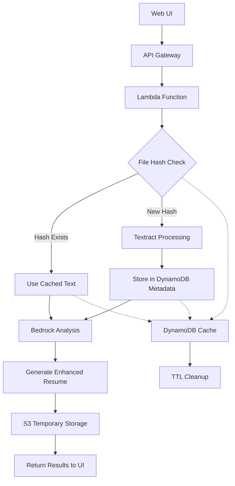

# Design Document (Simplified for Hackathon POC)

## Overview

The Resume Optimization Platform enhances the existing ATS Buddy system by adding intelligent file management, temporary storage, and AI-powered resume generation. The design focuses on cost optimization through hash-based deduplication and value-added features like AI-enhanced resume generation.

## Architecture

### System Architecture



### Key Architectural Elements

1. **DynamoDB Integration**: Used for temporary storage of resume metadata, extracted text, and analysis data
2. **Hash-Based Deduplication**: SHA-256 file hashing prevents redundant Textract processing
3. **Lambda Handler**: Orchestrates the workflow, including deduplication, Textract processing, analysis, and enhanced resume generation
4. **Resume Generation Service**: Uses Amazon Bedrock to generate enhanced resumes based on analysis results

## Components and Interfaces

### 1. Database Layer (DynamoDB)

**Resume Cache Table**: Stores resume metadata and extracted text
- Partition Key: `file_hash` (SHA-256 hash)
- Implements TTL for automatic cleanup (7 days)

### 2. Lambda Function

Handles the main workflow:
- Calculates file hash and checks the cache
- If the file doesn't exist, sends it to Textract
- Stores the file cache in DynamoDB
- Submits to Bedrock for analysis and enhancement

### 3. Resume Generation Service

Class and method to invoke Bedrock AI with prompts and instructions for resume enhancement

## Data Models

### Resume Cache Model
```typescript
interface ResumeCache {
    file_hash: string;           // SHA-256 hash (Partition Key)
    original_filename: string;   // User-provided filename
    extracted_text: string;      // Textract output
    ttl: number;                // TTL for cleanup
}
```

## Error Handling

- The lambda function will handle errors from each service
- If Bedrock integration fails, fall back to normal analysis without enhancement
- If DynamoDB is unavailable, proceed with normal processing (no caching)

## Testing Strategy

- Implement unit tests for hash calculation
- Manually test the end-to-end workflow to verify basic functionality (deduplication, analysis, and enhancement)

## Omitted (Out of Scope)

- Detailed database indexes
- Complex deduplication fallback strategies
- Analysis History Table (user session management removed)
- Comprehensive error handling beyond basic fallbacks