# 🏗️ ATS Buddy - AWS Architecture Diagram

## 📐 **High-Level Architecture**

```mermaid
graph TB
    subgraph Internet["🌐 Internet"]
        Users["👥 Job Seekers &amp; Recruiters"]
    end
    
    subgraph AWS["☁️ AWS Cloud - ap-southeast-1"]
        
        subgraph Global["🌍 Global Services"]
            CloudFront["CloudFront Distribution<br/>Global Edge Locations<br/>HTTPS + DDoS Protection"]
        end
        
        subgraph Frontend["🎨 Frontend Layer"]
            S3Web["S3 Bucket<br/>Private Web UI Hosting<br/>CloudFront OAC Only"]
        end
        
        subgraph APILayer["🚪 API Layer"]
            APIGateway["API Gateway<br/>REST API + CORS<br/>Regional Multi-AZ"]
        end
        
        subgraph ComputeLayer["⚡ Compute Layer"]
            Lambda["AWS Lambda<br/>ats-buddy-processor<br/>512MB, 5min, Python 3.13"]
            LambdaPII["AWS Lambda<br/>pii-redaction<br/>256MB, 1min, Python 3.13"]
        end
        
        subgraph AIServices["🧠 AI/ML Services"]
            Textract["Amazon Textract<br/>PDF Text Extraction<br/>Regional Multi-AZ"]
            Comprehend["Amazon Comprehend<br/>PII Detection<br/>Regional Multi-AZ"]
            Bedrock["Amazon Bedrock<br/>Nova Lite Model<br/>Regional Multi-AZ"]
        end
        
        subgraph StorageLayer["💾 Storage Layer"]
            S3Resumes["S3 Bucket<br/>Resume Storage<br/>12hr Lifecycle"]
            S3Reports["S3 Bucket<br/>Report Storage<br/>24hr Lifecycle"]
            DynamoDB["DynamoDB<br/>Resume Cache<br/>12hr TTL"]
        end
        
        subgraph Integration["🔄 Service Integration"]
            S3ObjectLambda["S3 Object Lambda<br/>PII Redaction Access Point"]
            IAM["AWS IAM<br/>Roles &amp; Policies"]
            CloudWatch["CloudWatch<br/>Logs &amp; Metrics"]
        end
    end
    
    Users --> CloudFront
    CloudFront --> S3Web
    CloudFront --> APIGateway
    APIGateway --> Lambda
    
    Lambda --> S3Resumes
    Lambda --> DynamoDB
    Lambda --> S3Reports
    Lambda --> Textract
    Lambda --> Bedrock
    
    S3Resumes --> S3ObjectLambda
    S3ObjectLambda --> LambdaPII
    LambdaPII --> Comprehend
    
    Lambda --> CloudWatch
    LambdaPII --> CloudWatch
    Lambda -.-> IAM
    
    classDef global fill:#f3e5f5,stroke:#7b1fa2,stroke-width:3px,color:#000
    classDef frontend fill:#e3f2fd,stroke:#0277bd,stroke-width:2px,color:#000
    classDef api fill:#fff3e0,stroke:#f57c00,stroke-width:2px,color:#000
    classDef compute fill:#FF9900,stroke:#232F3E,stroke-width:2px,color:#fff
    classDef ai fill:#01A88D,stroke:#232F3E,stroke-width:2px,color:#fff
    classDef storage fill:#3F8624,stroke:#232F3E,stroke-width:2px,color:#fff
    classDef integration fill:#DD344C,stroke:#232F3E,stroke-width:2px,color:#fff
    classDef users fill:#232F3E,stroke:#FF9900,stroke-width:3px,color:#FF9900
    
    class Users users
    class CloudFront global
    class S3Web frontend
    class APIGateway api
    class Lambda,LambdaPII compute
    class Textract,Comprehend,Bedrock ai
    class S3Resumes,S3Reports,DynamoDB storage
    class S3ObjectLambda,IAM,CloudWatch integration
```



## 🔄 **Data Flow Architecture**

```mermaid
flowchart TD
    A["👤 User uploads PDF resume"] --> B["🌐 Web UI validates file"]
    B --> C["🚪 API Gateway receives request"]
    C --> D["⚡ Lambda processes upload"]
    
    D --> E{"💾 Check DynamoDB cache"}
    E -->|Cache Hit| F["📋 Use cached text"]
    E -->|Cache Miss| G["📁 Store PDF in S3"]
    
    G --> H["📄 Textract extracts text"]
    H --> I["🔒 Comprehend detects PII"]
    I --> J["✏️ Redact sensitive data"]
    J --> K["💾 Cache processed text"]
    
    F --> L["🧠 Bedrock AI analysis"]
    K --> L
    L --> M["📊 Generate compatibility score"]
    M --> N["📝 Create improvement suggestions"]
    N --> O["📄 Generate HTML/MD reports"]
    
    O --> P["📁 Store reports in S3"]
    P --> Q["🔗 Generate presigned URLs"]
    Q --> R["📱 Return results to user"]
    R --> S["⬇️ User downloads reports"]
    
    P --> T["⏰ Lifecycle policies cleanup"]
    D --> U["📊 CloudWatch logging"]
    
    classDef input fill:#e3f2fd,stroke:#1976d2,stroke-width:2px,color:#000
    classDef processing fill:#f3e5f5,stroke:#7b1fa2,stroke-width:2px,color:#000
    classDef ai fill:#fff3e0,stroke:#f57c00,stroke-width:2px,color:#000
    classDef output fill:#e8f5e8,stroke:#388e3c,stroke-width:2px,color:#000
    classDef storage fill:#fce4ec,stroke:#c2185b,stroke-width:2px,color:#000
    
    class A,B,C input
    class D,E,G,H,I,J,K processing
    class L,M,N ai
    class O,P,Q,R,S output
    class F,T,U storage
```



## 🏛️ **AWS Well-Architected Framework Compliance**

### 🔒 **Security Pillar**
- **Identity & Access Management**: IAM roles with least privilege
- **Data Protection**: S3 encryption at rest and in transit
- **PII Protection**: Amazon Comprehend automatic redaction
- **CloudFront OAC**: Modern Origin Access Control (not legacy OAI)
- **Private Buckets**: No public S3 access, CloudFront only
- **HTTPS Enforcement**: TLS 1.2+ for all connections
- **Monitoring**: CloudTrail, CloudWatch security metrics

### ⚡ **Performance Efficiency**
- **Compute Optimization**: Right-sized Lambda functions (512MB/256MB)
- **Storage Optimization**: S3 Intelligent Tiering
- **Caching Strategy**: DynamoDB for deduplication (24hr TTL)
- **Content Delivery**: CloudFront global edge network
- **API Optimization**: Regional API Gateway with CORS
- **Monitoring**: Real-time performance metrics

### 🛡️ **Reliability**
- **AWS Managed Multi-AZ**: Built-in cross-AZ redundancy
- **Fault Tolerance**: Serverless auto-scaling and failover
- **Backup & Recovery**: S3 versioning enabled
- **Error Handling**: Graceful degradation and retry logic
- **Health Checks**: CloudWatch alarms and automated recovery
- **99.9%+ Availability**: Through managed services

### 💰 **Cost Optimization**
- **Pay-per-Use**: Serverless pricing model (no idle costs)
- **Auto-Scaling**: Lambda and DynamoDB on-demand
- **Storage Lifecycle**: Automatic cleanup (24hr)
- **CloudFront Caching**: Reduced origin requests
- **DynamoDB TTL**: Automatic data expiration
- **Cost Monitoring**: Budget alerts configured

### 🌱 **Operational Excellence**
- **Infrastructure as Code**: SAM/CloudFormation templates
- **Automated Deployment**: Single-command deployment
- **Monitoring & Logging**: Comprehensive CloudWatch integration
- **Documentation**: Architecture diagrams and runbooks
- **Testing**: Automated validation scripts

## 📊 **Service Specifications**

| Service | Configuration | Purpose | Multi-AZ |
|---------|---------------|---------|----------|
| **CloudFront** | Global CDN, HTTPS | Edge delivery, hides infrastructure | Global |
| **Lambda (Main)** | 512MB, 5min, Python 3.13 | Core processing orchestration | Auto |
| **Lambda (PII)** | 256MB, 1min, Python 3.13 | PII detection and redaction | Auto |
| **S3 (Resumes)** | Standard, 24hr lifecycle | Temporary PDF storage | Auto |
| **S3 (Reports)** | Standard, 24hr lifecycle | Analysis report storage | Auto |
| **S3 (Web UI)** | Private, OAC only | Frontend application | Auto |
| **DynamoDB** | On-demand, 12hr TTL | Resume processing cache | Auto |
| **API Gateway** | REST API, CORS enabled | HTTP API interface | Regional |
| **Textract** | Sync/Async APIs | PDF text extraction | Regional |
| **Comprehend** | PII detection API | Sensitive data identification | Regional |
| **Bedrock** | Nova Lite model | AI-powered analysis | Regional |

## 🔄 **AWS Managed Multi-AZ High Availability**

```mermaid
graph TB
    subgraph Global["🌍 Global CloudFront"]
        CF["CloudFront Distribution<br/>Global Edge Locations<br/>Automatic Failover<br/>100% SLA"]
    end
    
    subgraph Region["🏢 Region: ap-southeast-1"]
        
        subgraph Compute["Serverless Compute"]
            API["API Gateway<br/>Regional Multi-AZ<br/>99.95% Availability"]
            Lambda["AWS Lambda<br/>Auto-distributed across AZs<br/>99.95% Availability"]
        end
        
        subgraph Storage["Managed Storage"]
            S3["S3 Buckets<br/>Cross-AZ Replication<br/>99.999999999% Durability"]
            DDB["DynamoDB<br/>Multi-AZ Distribution<br/>99.999% Availability"]
        end
        
        subgraph AI["AI/ML Services"]
            AIServices["Textract + Bedrock + Comprehend<br/>Regional Multi-AZ<br/>99.9% Availability"]
        end
        
        subgraph Monitoring["Monitoring &amp; Security"]
            CW["CloudWatch<br/>Multi-AZ Metrics"]
            IAM["IAM<br/>Global Service"]
        end
    end
    
    CF --> API
    API --> Lambda
    Lambda --> S3
    Lambda --> DDB
    Lambda --> AIServices
    Lambda --> CW
    Lambda -.-> IAM
    
    classDef global fill:#e1f5fe,stroke:#0277bd,stroke-width:3px,color:#000
    classDef managed fill:#e8f5e8,stroke:#2e7d32,stroke-width:2px,color:#000
    classDef monitoring fill:#fff3e0,stroke:#ef6c00,stroke-width:2px,color:#000
    
    class CF global
    class API,Lambda,S3,DDB,AIServices managed
    class CW,IAM monitoring
```



## 🔐 **Security Architecture: CloudFront + OAC**

```mermaid
graph LR
    subgraph Public["🌐 Public Internet"]
        User["👥 Users"]
    end
    
    subgraph CloudFront["CloudFront Distribution"]
        Edge["Edge Location<br/>HTTPS Only<br/>TLS 1.2+"]
    end
    
    subgraph Private["🔒 Private AWS Resources"]
        S3["S3 Bucket<br/>Block Public Access: ON<br/>OAC Required"]
        API["API Gateway<br/>Resource Policy<br/>CloudFront Access"]
    end
    
    User -->|"HTTPS (443)"| Edge
    Edge -->|"OAC Signature"| S3
    Edge -->|"Custom Headers"| API
    
    classDef public fill:#ffebee,stroke:#c62828,stroke-width:2px,color:#000
    classDef edge fill:#e8f5e9,stroke:#2e7d32,stroke-width:2px,color:#000
    classDef private fill:#e3f2fd,stroke:#1565c0,stroke-width:2px,color:#000
    
    class User public
    class Edge edge
    class S3,API private
```



## 🏗️ **AWS Managed Multi-AZ Implementation**

### ✅ **Automatic Multi-AZ Services**
| Service | Multi-AZ Implementation | Availability | Durability |
|---------|------------------------|---------------|------------|
| **CloudFront** | Global edge locations | 100% SLA | N/A |
| **S3** | Automatic cross-AZ replication | 99.99% | 99.999999999% |
| **DynamoDB** | Auto-distributed across AZs | 99.999% | 99.999999999% |
| **Lambda** | AWS distributes across AZs | 99.95% | Stateless |
| **API Gateway** | Regional multi-AZ service | 99.95% | N/A |
| **Textract** | Regional multi-AZ | 99.9% | N/A |
| **Bedrock** | Regional multi-AZ | 99.9% | N/A |
| **Comprehend** | Regional multi-AZ | 99.9% | N/A |

### 🔄 **Automatic Failover Mechanisms**
- **CloudFront → S3/API Gateway**
    - Edge location health checks (every 10 seconds)
    - Automatic routing to healthy origins
    - No manual intervention required

- **Lambda Cross-AZ Distribution**
    - AWS automatically distributes across 3+ AZs
    - Automatic retry in different AZ on failure
    - Sub-second failover time

- **S3 Cross-AZ Replication**
    - Instant failover to healthy AZ partitions
    - Transparent to applications
    - Zero RPO (Recovery Point Objective)

- **DynamoDB Global Tables**
    - Active-active across AZs
    - Automatic conflict resolution
    - Continuous replication

## 💡 Cost-Performance Trade-offs
**Current Configuration (Optimized for Hackathon)**
```text
Monthly Estimate (1000 resumes processed):
├─ CloudFront:        $5   (data transfer + requests)
├─ Lambda:            $15  (512MB × 1000 invocations)
├─ S3:                $2   (storage + lifecycle)
├─ DynamoDB:          $3   (on-demand reads/writes)
├─ Textract:          $20  (1000 pages extracted)
├─ Bedrock:           $25  (Nova Lite model)
├─ API Gateway:       $5   (REST API requests)
└─ Total:             ~$75/month

Cost per resume: $0.075
```

**Production Scaling (10,000 resumes/month)**
```text
Monthly Estimate:
├─ CloudFront:        $15  (higher data transfer)
├─ Lambda:            $120 (sustained invocations)
├─ S3:                $10  (more storage)
├─ DynamoDB:          $20  (higher throughput)
├─ Textract:          $180 (10K pages)
├─ Bedrock:           $200 (higher usage)
├─ API Gateway:       $25  (more requests)
└─ Total:             ~$570/month

Cost per resume: $0.057 (24% cheaper at scale)
```

## 🚀 Deployment Architecture

```mermaid
graph LR
    subgraph Dev["👨‍💻 Developer"]
        Code["Source Code<br/>SAM Template"]
    end
    
    subgraph Deploy["🚀 Deployment"]
        SAM["AWS SAM CLI<br/>sam build<br/>sam deploy"]
    end
    
    subgraph CFN["☁️ CloudFormation"]
        Stack["Stack Creation<br/>Resource Provisioning<br/>Output Generation"]
    end
    
    subgraph AWS["🏢 AWS Services"]
        Resources["Lambda + S3 + API<br/>DynamoDB + IAM<br/>CloudFront + OAC"]
    end
    
    Code --> SAM
    SAM --> CFN
    CFN --> Resources
    
    classDef dev fill:#e1f5fe,stroke:#0277bd,stroke-width:2px,color:#000
    classDef deploy fill:#fff3e0,stroke:#f57c00,stroke-width:2px,color:#000
    classDef cfn fill:#f3e5f5,stroke:#7b1fa2,stroke-width:2px,color:#000
    classDef aws fill:#e8f5e9,stroke:#2e7d32,stroke-width:2px,color:#000
    
    class Code dev
    class SAM deploy
    class Stack cfn
    class Resources aws
```


## **🎯 Architecture Highlights**
**Security First 🔒**
- CloudFront hides all infrastructure (no exposed account IDs)
- Origin Access Control (OAC) for modern S3 security
- All buckets private (no public access)
- HTTPS enforcement with TLS 1.2+
- IAM least privilege access
- PII automatic redaction

**Serverless & Scalable 📈**
- Zero idle costs (pay-per-use)
- Auto-scaling from 0 to millions
- No infrastructure management
- Automatic Multi-AZ distribution
- Built-in high availability

**Cost Optimized 💰**
- $0.075 per resume processed
- 24% cheaper at scale
- Automatic resource cleanup (12hr/24hr)
- DynamoDB caching reduces costs
- CloudFront reduces origin requests

**Well-Architected 🏗️**
- Follows all 5 AWS pillars
- Production-ready design
- Enterprise-grade reliability
- Comprehensive monitoring
- Infrastructure as Code

## **📊 Architecture demonstrates:**
- **99.9%+ Availability** through AWS managed multi-AZ services
- **Security-first** approach with CloudFront + OAC + PII protection
- **Cost-optimized** serverless design ($0.075 per resume)
- **Performance-tuned** with global CDN and intelligent caching
- **Compliance-ready** with comprehensive logging and encryption